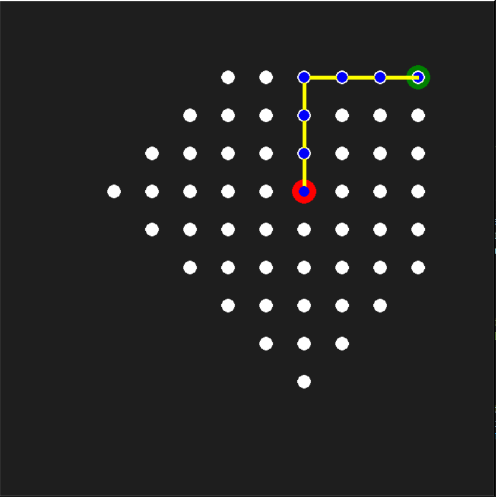
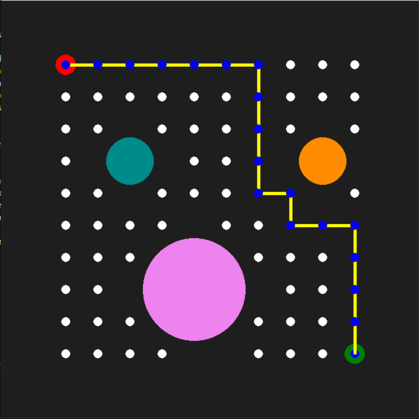
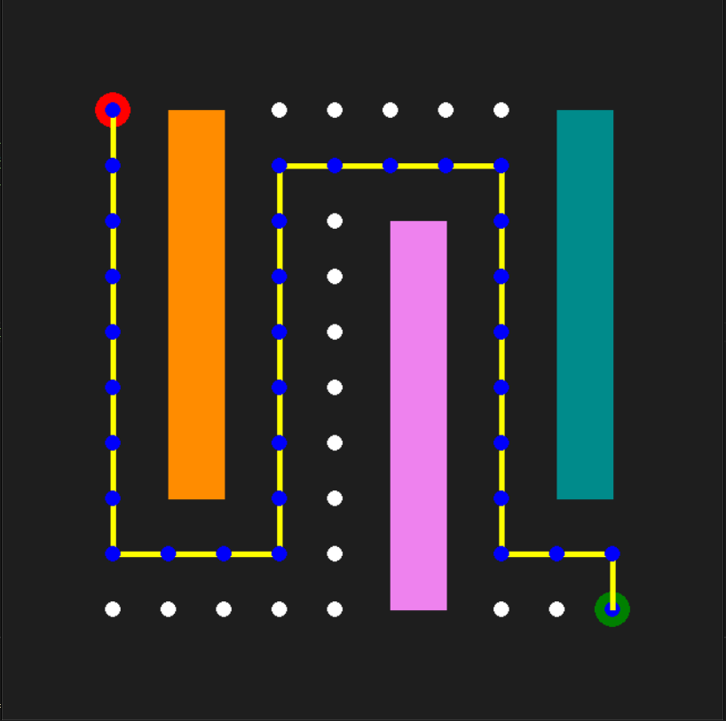
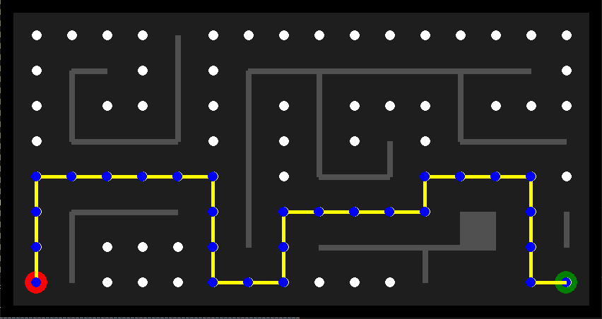

# Breath First Search [BFS] Algorithm

### Task:

Implement Breath First Search [BFS] algorithm on a map between a given start and goal node. The repository contains 3 files:

- **BFS_emptyMap.py** - The 10 x 10 map is empty. The script finds BFS generated path between two nodes.
- **BFS_obsMap.py** - The 10 x 10 map has obstacles. The script finds the BFS generated path between the two nodes while avoiding obstacle space. There algorithm can be mplemented on two maps.  Set the variable 'mapNumber' to 1 or to 2 in the main function to switch between maps.
- **BFS_Maze.py** - Maze Map of size 16 x 8. The script finds BFS generated path between two nodes.
        
### Path is visualized using pygame. 
- Start Node is Red
- Goal Node is Green
- Solution Path is in Blue/Yellow
- Explored Nodes are in White

### 4 action steps. Search Sequence: 

        Up --> Right --> Down --> Left

## Breath First Search 

### Tree Exploration Sequence: 

BFS is a graph traversing algorithm. The traversal occurs layerwise, the neighbour nodes are visited first. The queue works on the FIFO model. The breathwise exploration is shown in the illustration below: 

        

## Empty Map Results 

Start Node:(1,1) --> Goal Node:(5,5) |  Start Node:(7,9) --> Goal Node:(1,2)| Start Node:(6,6) --> Goal Node:(10,10)
:-------------------------:|:-------------------------:|:-------------------------:
  |  | 

## Obstacle Map Results 

Map 1: (1,10) --> (10,1)   |  Map 2: (1,10) --> (10,1) 
:-------------------------:|:-------------------------:
  |  

## Maze Map Results

        Start Node:(1,1) --> Goal Node:(16,1)

       

## Support
For any questions, email me at jaisharm@umd.edu
